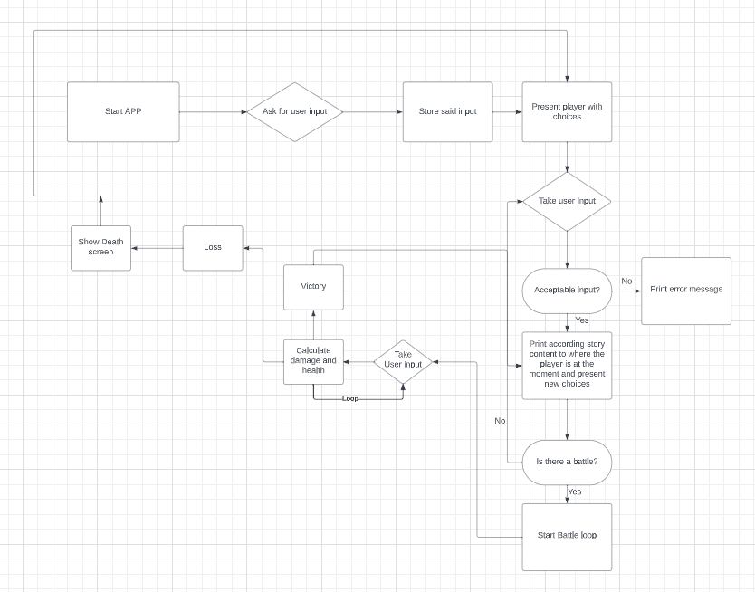

# CPP Game - story based adventure with slight RPG elements

### Operating system and Visual studio versions used to test and write the program:

##### OS: Windows 10 pro 10.0.19045 Build 19045
##### Visual studios: 2022 v143, windows SDK 10.0, 64x

### How does it play?

##### Player chooses their name and Race (No impact on gameplay), followed by story elements describing the world
##### and what is going on. for example the player is in the forest, infront is a mansion, to the right some sort
##### of creature. both are described, then the player chooses whether they would like to go towards the mansion
##### or creature. after each choice, extra story elements are given. player goes through this cycle till either 
##### the end or the player finds themselves in a battle situation ending in either victory or death.

